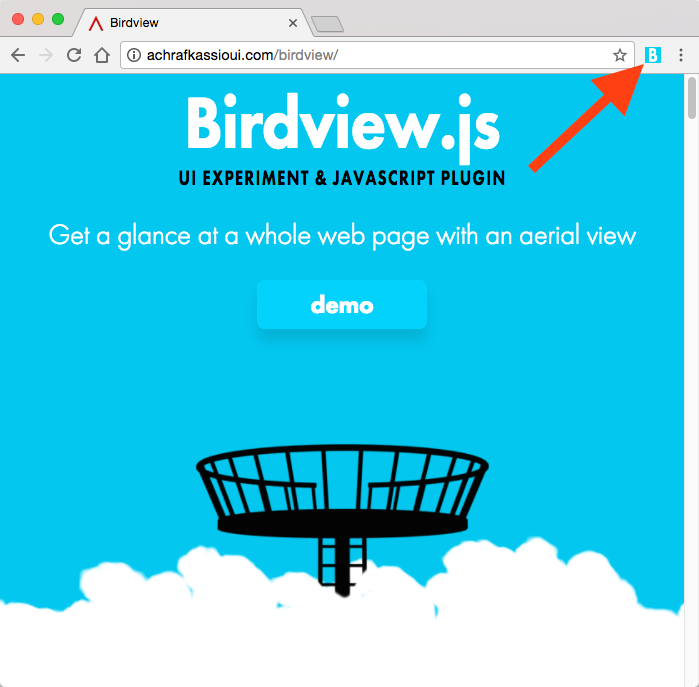
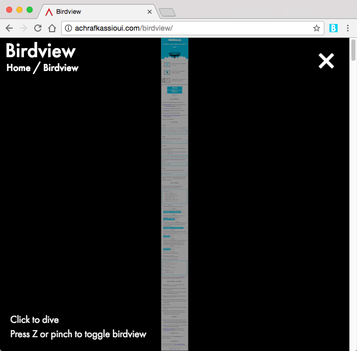

#  Birdview

> Chrome Extension that gives you a glance at a whole web page with an aerial view

**[Install in Chrome]()**

_Based on [Achraf Kassioui](https://twitter.com/achrafkassioui)'s [Birdview.js](http://achrafkassioui.com/birdview)._

